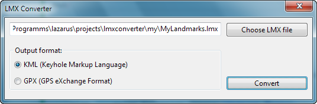
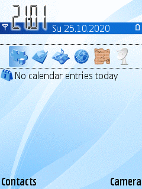

# Lmx Converter

## Nokia landmarks converter



Converts Nokia landmarks files ([LMX](https://wiki.openstreetmap.org/wiki/LMX)) to/from another formats ([KML](https://en.wikipedia.org/wiki/Keyhole_Markup_Language) and [GPX](https://en.wikipedia.org/wiki/GPS_Exchange_Format)). This may be useful if you want to export landmarks from your Nokia phone to other programs (like [JOSM](https://josm.openstreetmap.de/) or [Google Earth](https://www.google.com/earth/)). Converted files save in the same dir.

## Download

You can download latest build for MS Windows [here](https://github.com/artem78/LmxConverter/releases/latest).

## How to get lmx-file from my phone?

1. Go to `Configurations` --> `Landmarks` or `Applications` --> `Location` --> `Landmarks` depending of your Symbian OS version
1. Select landmarks you want to export
1. In menu press `Send`, write any file name and choose suitable transferring method



## List of exported fields

|                                     | LMX | GPX | KML |
|-------------------------------------|-----|-----|-----|
| Name                                |  +  |  +  |  +  |
| Description                         |  +  |  +  |  +  |
| Coordinates (latitude and longitude)|  +  |  +  |  +  |
| Altitude                            |  +  |  +  |  +  |
| Accuracy (horizontal and vertical)  |  +  |     |     |
| Address                             |  +  |     |  +  |
| Phone number                        |  +  |     |  +  |
| Link                                |     |     |     |
| Category                            |  +  |     |  +  |

## Conversion examples

input file `MyLandmarks.lmx`:
```xml
<?xml version="1.0" encoding="UTF-8"?>
<lm:lmx xmlns:lm="http://www.nokia.com/schemas/location/landmarks/1/0" xmlns:xsi="http://www.w3.org/2001/XMLSchema-instance" xsi:schemaLocation="http://www.nokia.com/schemas/location/landmarks/1/0/ lmx.xsd">
	<lm:landmarkCollection>
		<lm:name>Test landmarks</lm:name>
		<lm:landmark>
			<lm:name>Mount Everest</lm:name>
			<lm:description>The highest point of the Earth</lm:description>
			<lm:coordinates>
				<lm:latitude>27.98806</lm:latitude>
				<lm:longitude>86.92528</lm:longitude>
				<lm:altitude>8848.86</lm:altitude>
				<lm:horizontalAccuracy></lm:horizontalAccuracy>
				<lm:verticalAccuracy></lm:verticalAccuracy>
			</lm:coordinates>
			<lm:addressInfo>
				<lm:street></lm:street>
				<lm:postalCode></lm:postalCode>
				<lm:city></lm:city>
				<lm:state></lm:state>
				<lm:country></lm:country>
				<lm:phoneNumber></lm:phoneNumber>
			</lm:addressInfo>
			<lm:category>
				<lm:name>Mountains</lm:name>
			</lm:category>
			<lm:category>
				<lm:name>World records</lm:name>
			</lm:category>
		</lm:landmark>
		<lm:landmark>
			<lm:name>Mariana Trench</lm:name>
			<lm:coordinates>
				<lm:latitude>11.35</lm:latitude>
				<lm:longitude>142.2</lm:longitude>
				<lm:altitude>-10984</lm:altitude>
			</lm:coordinates>
			<lm:category>
				<lm:name>World records</lm:name>
			</lm:category>
		</lm:landmark>
		<lm:landmark>
			<lm:name>Some place</lm:name>
			<lm:description>This is the description of very interesting place. It can cantains special characters like @/;+&amp;%&lt;&gt;£€$¥¤[]{}~№#|§. Также можно писать по-русски и даже по-китайски - 漢語, 汉语, 中文.</lm:description>
			<lm:coordinates>
				<lm:latitude>-56.1234</lm:latitude>
				<lm:longitude>-44.9876</lm:longitude>
				<lm:altitude>123.669998168945</lm:altitude>
				<lm:horizontalAccuracy>101.620002746582</lm:horizontalAccuracy>
				<lm:verticalAccuracy>5.32000017166138</lm:verticalAccuracy>
			</lm:coordinates>
			<lm:addressInfo>
				<lm:street>Long Street</lm:street>
				<lm:postalCode>123456</lm:postalCode>
				<lm:city>London</lm:city>
				<lm:state>Some state</lm:state>
				<lm:country>Great Britain</lm:country>
				<lm:phoneNumber>+01112223344</lm:phoneNumber>
			</lm:addressInfo>
			<lm:category>
				<lm:name>Test</lm:name>
			</lm:category>
		</lm:landmark>
		<lm:landmark>
			<lm:name>Lat and Lon only</lm:name>
			<lm:coordinates>
				<lm:latitude>46.3393</lm:latitude>
				<lm:longitude>48.035</lm:longitude>
			</lm:coordinates>
		</lm:landmark>
	</lm:landmarkCollection>
</lm:lmx>
```

output file `MyLandmarks.kml`:
```xml
<?xml version="1.0" encoding="UTF-8"?>
<kml xmlns="http://www.opengis.net/kml/2.2">
  <Document>
    <Folder>
      <name>Mountains</name>
      <Placemark>
        <name>Mount Everest</name>
        <description><![CDATA[The highest point of the Earth]]></description>
        <Point>
          <coordinates>86.92528,27.98806,8848.86</coordinates>
        </Point>
      </Placemark>
    </Folder>
    <Folder>
      <name>World records</name>
      <Placemark>
        <name>Mount Everest</name>
        <description><![CDATA[The highest point of the Earth]]></description>
        <Point>
          <coordinates>86.92528,27.98806,8848.86</coordinates>
        </Point>
      </Placemark>
      <Placemark>
        <name>Mariana Trench</name>
        <Point>
          <coordinates>142.2,11.35,-10984</coordinates>
        </Point>
      </Placemark>
    </Folder>
    <Folder>
      <name>Test</name>
      <Placemark>
        <name>Some place</name>
        <address>Long Street, London, Some state, Great Britain, 123456</address>
        <phoneNumber>+01112223344</phoneNumber>
        <description><![CDATA[This is the description of very interesting place. It can cantains special characters like @/;+&%<>£€$¥¤[]{}~№#|§. Также можно писать по-русски и даже по-китайски - 漢語, 汉语, 中文.]]></description>
        <Point>
          <coordinates>-44.9876,-56.1234,123.669998168945</coordinates>
        </Point>
      </Placemark>
    </Folder>
    <Placemark>
      <name>Lat and Lon only</name>
      <Point>
        <coordinates>48.035,46.3393</coordinates>
      </Point>
    </Placemark>
  </Document>
</kml>
```

output file `MyLandmarks.gpx`:
```xml
<?xml version="1.0" encoding="UTF-8"?>
<gpx xmlns="http://www.topografix.com/GPX/1/1" version="1.1" creator="" xmlns:xsi="http://www.w3.org/2001/XMLSchema-instance" xsi:schemaLocation="http://www.topografix.com/GPX/1/1 http://www.topografix.com/GPX/1/1/gpx.xsd">
  <wpt lat="27.98806" lon="86.92528">
    <ele>8848.86</ele>
    <name>Mount Everest</name>
    <desc>The highest point of the Earth</desc>
  </wpt>
  <wpt lat="11.35" lon="142.2">
    <ele>-10984</ele>
    <name>Mariana Trench</name>
  </wpt>
  <wpt lat="-56.1234" lon="-44.9876">
    <ele>123.669998168945</ele>
    <name>Some place</name>
    <desc>This is the description of very interesting place. It can cantains special characters like @/;+&amp;%&lt;&gt;£€$¥¤[]{}~№#|§. Также можно писать по-русски и даже по-китайски - 漢語, 汉语, 中文.</desc>
  </wpt>
  <wpt lat="46.3393" lon="48.035">
    <name>Lat and Lon only</name>
  </wpt>
</gpx>
```
